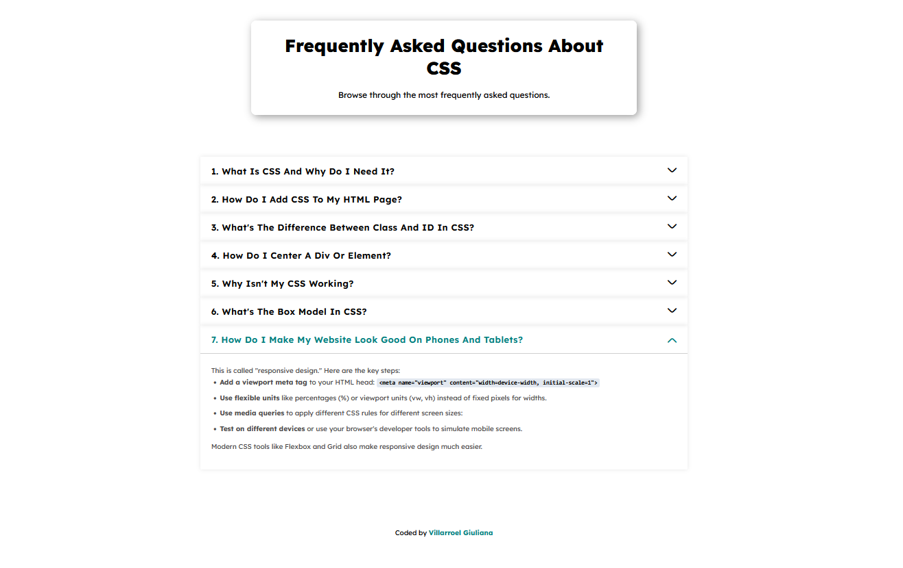

# CSS FAQ - Frequently Asked Questions About CSS

## Project Overview

This is a personal FAQ (Frequently Asked Questions) project about CSS that I developed to practice and strengthen my frontend web development skills. The project features a clean, modern design with interactive accordion functionality to display answers to the most common CSS questions.

## Screenshot

## Project Goals

The main objectives of this project were to:

- Practice creating interactive components with vanilla JavaScript
- Implement responsive and accessible design
- Apply knowledge of semantic HTML and modern CSS
- Develop skills in DOM manipulation and event handling
- Create useful educational content about CSS

## Key Features

- **Interactive Accordion**: Each question can be expanded/collapsed on click
- **Educational Content**: Real questions and answers about important CSS concepts
- **Clean Interface**: Minimalist design focused on readability
- **Accessibility**: Keyboard navigation and semantic structure

## Questions Covered

The FAQ covers essential CSS topics including:

1. What Is CSS And Why Do I Need It?
2. How Do I Add CSS To My HTML Page?
3. What's The Difference Between Class And ID In CSS?
4. How Do I Center A Div Or Element?
5. Why Isn't My CSS Working?
6. What's The Box Model In CSS?
7. How Do I Make My Website Look Good On Phones And Tablets?

## Technologies Used

- **HTML5**: Semantic and accessible structure
- **CSS3**: Modern styling, flexbox, transitions, and adaptative design
- **JavaScript ES6+**: Accordion functionality and DOM manipulation
- **Design**: Original design

## Implemented Features

### JavaScript Accordion
- Click to expand/collapse questions
- Visual indicators (rotating arrows)

### User Interactions
- Hover states on interactive elements
- Immediate visual feedback

## What I Learned

Throughout the development of this project, I reinforced knowledge in:

- **JavaScript DOM**: Element selection, event listeners, class manipulation
- **CSS Flexbox**: Creating flexible layouts and element centering
- **CSS Transitions**: Smooth animations to enhance user experience
- **Responsive Design**: Adaptive design patterns
- **Web Accessibility**: Clear structure and keyboard navigation support

## Future Improvements

- [ ] Add more questions about advanced CSS topics
- [ ] Implement real-time search functionality
- [ ] Add dark mode toggle
- [ ] Include interactive code examples
- [ ] Optimize for better performance
- [ ] Add unit testing

## Author

**Your Name**
- GitHub: [@gvillarroel-dev](https://github.com/gvillarroel-dev)

---

*Project developed for educational purposes to practice frontend web development skills.*